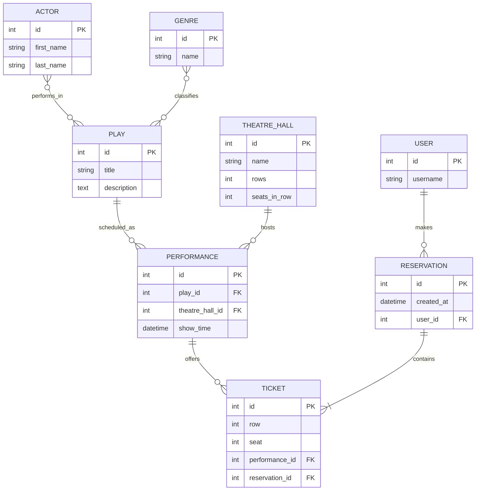

# Theatre Service API

A Django REST Framework API for managing theatre plays, casts, genres, halls, performances, and seat reservations. The project uses the **Theatre (Easy)** model from the portfolio assignment and adds JWT authentication, seat availability, and transactional booking.

## Features

- CRUD endpoints for plays, actors, genres, theatre halls, and performances.
- Filter plays by actor or genre and performances by play, hall, or show date.
- Search and ordering on catalogue endpoints, with paginated responses.
- Public account registration and JWT access/refresh tokens.
- List available seats for a performance and reserve multiple seats in one request.
- Prevent booking past performances, out-of-range seats, duplicate selections, and seats already reserved.
- Keep reservations private to their owner; authenticated users can view or cancel their own reservations.
- Django admin, Browsable API, Swagger UI, and ReDoc.
- PostgreSQL support for Docker and SQLite for a quick local setup.

## Run locally

The local setup below uses SQLite and does not require Docker.

### Requirements

- Python 3.11 or newer
- pip

### Windows PowerShell

```powershell
python -m venv .venv
.venv\Scripts\Activate.ps1
python -m pip install --upgrade pip
pip install -r requirements.txt
$env:DJANGO_SECRET_KEY = "replace-this-with-a-long-random-secret"
$env:DJANGO_DEBUG = "True"
python manage.py migrate
python manage.py loaddata theatre/fixtures/sample_data.json
python manage.py createsuperuser
python manage.py runserver
```

The API is available at `http://127.0.0.1:8000/api/`. Visit `/api/` for the Browsable API, `/api/docs/` for Swagger UI, `/api/redoc/` for ReDoc, and `/admin/` for Django admin.

### macOS or Linux

```bash
python3 -m venv .venv
source .venv/bin/activate
python -m pip install --upgrade pip
pip install -r requirements.txt
export DJANGO_SECRET_KEY="replace-this-with-a-long-random-secret"
export DJANGO_DEBUG=True
python manage.py migrate
python manage.py loaddata theatre/fixtures/sample_data.json
python manage.py createsuperuser
python manage.py runserver
```

## Run with Docker Compose

Docker Compose starts PostgreSQL and the API. The API container applies migrations on startup.

```bash
docker compose up --build
```

Open `http://127.0.0.1:8000/api/`. To add sample catalogue data, run:

```bash
docker compose exec api python manage.py loaddata theatre/fixtures/sample_data.json
```

Create an administrator account with `docker compose exec api python manage.py createsuperuser`. Stop the services with `docker compose down`; preserve the database volume, or remove it and its data, with `docker compose down -v`.

For deployment, set a strong `DJANGO_SECRET_KEY`, set `DJANGO_DEBUG=False`, and configure `DJANGO_ALLOWED_HOSTS` and `DATABASE_URL` for the deployment environment. The credentials in the Compose file are for local development only.

## Authentication and booking

Catalogue `GET` requests are public. Creating, updating, and deleting plays, actors, genres, halls, and performances requires a staff account (`is_staff=True`). Public registration creates regular accounts, which cannot modify the catalogue. Create an administrator locally with `python manage.py createsuperuser` or `docker compose exec api python manage.py createsuperuser`. Reservations require a JWT. Create a regular account through the API:

```http
POST /api/auth/register/
Content-Type: application/json

{
  "username": "theatre_fan",
  "password": "a-strong-password",
  "password_confirmation": "a-strong-password"
}
```

Exchange the account credentials for tokens:

```http
POST /api/auth/token/
Content-Type: application/json

{
  "username": "theatre_fan",
  "password": "a-strong-password"
}
```

Send the returned access token as `Authorization: Bearer <access-token>`. Refresh an expired access token at `POST /api/auth/token/refresh/` with `{"refresh": "<refresh-token>"}`.

Browse upcoming performances at `GET /api/performances/`. Check open seats at `GET /api/performances/{id}/available-seats/`, then reserve one or more seats:

```http
POST /api/reservations/
Authorization: Bearer <access-token>
Content-Type: application/json

{
  "tickets": [
    {"performance": 1, "row": 2, "seat": 5},
    {"performance": 1, "row": 2, "seat": 6}
  ]
}
```

Use `GET /api/reservations/` to see the current user's bookings and `DELETE /api/reservations/{id}/` to cancel one. A reservation can include seats from more than one performance. The database enforces one ticket per seat and performance, and the booking transaction fails as a whole if a selected seat is no longer available.

## API endpoints

| Resource | Endpoints |
| --- | --- |
| Plays | `/api/plays/`, `/api/plays/{id}/` |
| Actors | `/api/actors/`, `/api/actors/{id}/` |
| Genres | `/api/genres/`, `/api/genres/{id}/` |
| Theatre halls | `/api/theatre-halls/`, `/api/theatre-halls/{id}/` |
| Performances | `/api/performances/`, `/api/performances/{id}/`, `/api/performances/{id}/available-seats/` |
| Reservations | `/api/reservations/`, `/api/reservations/{id}/` |
| Authentication | `/api/auth/register/`, `/api/auth/token/`, `/api/auth/token/refresh/` |
| API schema | `/api/schema/`, `/api/docs/`, `/api/redoc/` |

Common catalogue filters include `/api/plays/?genre=1`, `/api/plays/?actor=2`, `/api/performances/?play=1`, `/api/performances/?theatre_hall=1`, and `/api/performances/?show_time=2027-01-15`. Search with `?search=cherry`; order with `?ordering=show_time` or `?ordering=-title`. List endpoints use page-number pagination (`?page=2`).

## Database structure

The editable draw.io diagram is [docs/database-diagram.drawio](docs/database-diagram.drawio).


